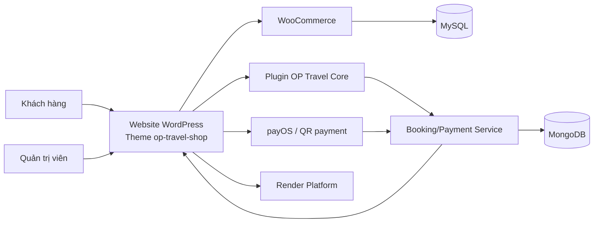
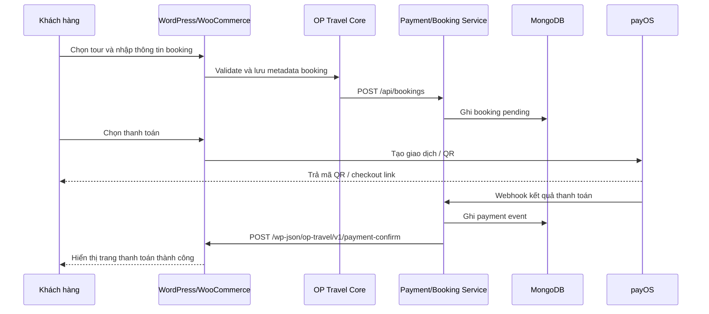

# Phase 1 - Tổng quan đề tài và kiến trúc hệ thống

## Mục tiêu phase
Xác định bài toán của HV-Travel, phạm vi hệ thống, các thành phần kỹ thuật chính và mối quan hệ giữa `WordPress`, `WooCommerce`, `MySQL`, `MongoDB`, `Docker`, `Render`.

## Đầu vào
- Chủ đề BCCĐ: website bán vé tour du lịch
- Repo hiện tại của dự án WordPress
- Theme `op-travel-shop`
- Plugin `op-travel-core`
- Yêu cầu có thanh toán trực tuyến, quét mã QR và thông báo thanh toán thành công

## Đầu ra
- Một kiến trúc tổng thể đủ rõ để giải thích cho giảng viên
- Một câu chuyện kỹ thuật nhất quán giữa source code và hướng mở rộng
- Cơ sở để đi tiếp sang các phase cấu hình, plugin, thanh toán, MongoDB và deploy

## Ý nghĩa với BCCĐ
Đây là phase định vị đồ án. Nếu phase này rõ, toàn bộ phần trình bày sau sẽ có logic thống nhất: vì sao chọn WordPress, vì sao vẫn dùng MySQL, vì sao MongoDB không gắn trực tiếp vào core, vì sao dùng plugin riêng và vì sao triển khai bằng Docker trên Render.

## Lý do chọn đề tài
- Du lịch là bài toán thực tế, gần với thương mại điện tử dịch vụ.
- WooCommerce cho phép tận dụng quy trình giỏ hàng, checkout, đơn hàng và tài khoản khách hàng.
- Tour du lịch khác hàng hóa thông thường nên phù hợp để chứng minh năng lực tùy biến plugin.
- Đề tài dễ triển khai demo trực quan: chọn tour, giữ chỗ, thanh toán, xem trạng thái đơn.
- Đề tài đủ rộng để đưa vào `MongoDB`, `Docker` và `cloud deploy` mà không bị khiên cưỡng.

## Bài toán nghiệp vụ
HV-Travel giải quyết quy trình đặt tour trực tuyến gồm các bước:

1. Khách truy cập website và xem danh sách tour.
2. Khách mở trang chi tiết tour, chọn ngày khởi hành, số người lớn, số trẻ em và ghi chú.
3. Khách thêm tour vào giỏ hàng và xác nhận lại thông tin booking.
4. Khách vào trang checkout, điền thông tin liên hệ và chọn phương thức thanh toán.
5. Hệ thống sinh mã QR hoặc link thanh toán online.
6. Sau khi thanh toán thành công, đơn hàng được cập nhật trạng thái và hiển thị thông báo hoàn tất.
7. Dữ liệu booking, payment, event log được đồng bộ sang MongoDB để phục vụ báo cáo và theo dõi nghiệp vụ.

## Phạm vi hệ thống
### Trong phạm vi
- Quản trị tour bằng WooCommerce product
- Thêm taxonomy và metadata riêng cho tour
- Giao diện theme chuyên cho website du lịch
- Booking fields trên trang chi tiết tour
- Lưu metadata booking vào cart và order
- Hiển thị QR theo order
- Tích hợp thanh toán online định hướng `payOS`
- Đồng bộ booking/payment sang MongoDB thông qua service riêng
- Deploy online bằng Docker và Render

### Ngoài phạm vi
- ERP nội bộ cho công ty du lịch
- Quản lý tồn kho vé máy bay thời gian thực
- Tích hợp CRM đầy đủ
- Tích hợp bản đồ vận hành thời gian thực cho tài xế/điều phối

## Đối tượng sử dụng
- `Khách hàng`: xem tour, đặt tour, thanh toán, theo dõi đơn
- `Quản trị viên nội dung`: tạo tour, tạo khuyến mãi, cập nhật testimonial
- `Nhân viên điều hành`: xem booking, đối chiếu thanh toán, xử lý liên hệ
- `Nhóm triển khai kỹ thuật`: cấu hình hệ thống, deploy, backup, giám sát log

## Stack công nghệ
- `CMS / storefront`: WordPress
- `Commerce engine`: WooCommerce
- `Theme custom`: `op-travel-shop`
- `Plugin business`: `op-travel-core`
- `Core DB`: MySQL
- `Business DB`: MongoDB
- `Payment`: payOS chính, BCK dự phòng
- `Containers`: Docker
- `Cloud deploy`: Render
- `Email`: WP Mail SMTP
- `Backup`: UpdraftPlus
- `Security`: Wordfence

## Các quyết định kiến trúc bắt buộc
- `WordPress + WooCommerce + MySQL` luôn là lõi storefront, cart, checkout, order và admin content.
- `op-travel-shop` chỉ nên sở hữu giao diện, trải nghiệm đặt tour và WooCommerce template overrides.
- `op-travel-core` phải sở hữu taxonomy, metadata tour, booking flow, QR demo và cầu nối REST cho nghiệp vụ.
- `MongoDB` không thay thế database core của WordPress; nó chỉ đứng sau một service business riêng.
- `payOS` là hướng thanh toán online chính, còn `BCK` và QR demo giữ vai trò fallback/minh họa.
- Chi tiết endpoint, env, status và payload chuẩn được khóa ở `Phase 10`, không tự đổi tên trong các phase sau.

## Kiến trúc tổng thể

## Sơ đồ luồng dữ liệu mức cao

## Ma trận trách nhiệm thành phần
| Thành phần | Sở hữu chính | Không nên gánh | Vai trò trong câu chuyện bảo vệ |
| --- | --- | --- | --- |
| `WordPress + WooCommerce` | Product tour, cart, checkout, order, admin nội dung | Webhook audit, business report, replace MongoDB | Chứng minh vì sao dùng nền tảng có sẵn để rút ngắn thời gian dựng hệ thống |
| `op-travel-shop` | Trang chủ, archive tour, single tour, responsive storefront, WooCommerce overrides | Lưu booking nghiệp vụ, xử lý webhook, logic payment | Chứng minh năng lực tùy biến giao diện theo hành trình khách du lịch |
| `op-travel-core` | Taxonomy, metadata tour, booking fields, cart/order meta, QR demo, REST bridge | Quản lý layout tổng thể, vận hành MongoDB trực tiếp | Chứng minh năng lực lập trình plugin và đóng gói business logic riêng |
| `Booking/Payment Service` | Đồng bộ booking, nhận webhook payOS, gọi callback về WordPress, chuẩn hóa dữ liệu nghiệp vụ | Render giao diện storefront, thay WooCommerce checkout | Chứng minh kiến trúc tách lớp và khả năng mở rộng ra ngoài WordPress core |
| `MongoDB` | `bookings`, `payments`, `payment_events`, `contacts`, `reports` | Thay thế order DB của WooCommerce | Chứng minh cách lưu dữ liệu nghiệp vụ linh hoạt và phục vụ báo cáo |
| `Docker + Render` | Chuẩn hóa local/prod, đóng gói service, deploy online, persistent storage | Chứa business logic ứng dụng | Chứng minh sinh viên làm chủ cấu hình, môi trường và triển khai thật |

## Vai trò WordPress/WooCommerce
- Là lớp giao diện chính mà khách hàng nhìn thấy.
- Là hệ thống quản trị nội dung, trang tĩnh, menu, media.
- Là engine cho product, cart, checkout, order, account.
- Là nơi quản trị viên tạo tour, khuyến mãi và nội dung marketing.
- Là điểm tích hợp để plugin tùy biến thêm booking fields, QR panel và logic riêng.

## Vai trò MongoDB
- Không thay WordPress core database.
- Là nơi lưu `bookings`, `payments`, `payment_events`, `contacts`, `reports`.
- Hỗ trợ lưu document linh hoạt cho dữ liệu nghiệp vụ thay đổi nhanh.
- Thuận tiện cho thống kê doanh thu, lịch sử giao dịch, log webhook và dashboard quản trị.

## Ranh giới dữ liệu MySQL và MongoDB
- `MySQL` giữ dữ liệu vận hành bắt buộc của WordPress/WooCommerce như user, product, cart, order và order meta.
- `MongoDB` giữ snapshot nghiệp vụ và audit trail như booking đã gửi sang service, lịch sử payment, webhook events và dữ liệu báo cáo.
- Đồng bộ dữ liệu phải đi qua service riêng để giữ WordPress nhẹ, tránh đẩy logic business report vào core website.
- Khi giải thích với giảng viên, cần nhấn mạnh mô hình này là `core commerce ở MySQL` và `business analytics ở MongoDB`, không phải hai database cùng làm một việc.

## Vai trò Docker
- Chuẩn hóa môi trường local và môi trường chạy online.
- Giảm sai khác giữa máy phát triển và máy triển khai.
- Tách rõ dịch vụ WordPress, MySQL, MongoDB, API service.
- Dễ mô tả trong phần “sinh viên cấu hình”.

## Vai trò Render
- Cung cấp nền tảng chạy online thực tế cho BCCĐ.
- Hỗ trợ deploy từ Git, dùng Dockerfile và cấu hình biến môi trường.
- Có thể tách web service và private service.
- Có persistent disk cho dữ liệu không được mất khi restart.

## Minh chứng trong source code
- `wp-config.php`: cho thấy dự án hiện đang dùng WordPress với DB kiểu MySQL
- `wp-content/themes/op-travel-shop/functions.php`
- `wp-content/themes/op-travel-shop/inc/woocommerce.php`
- `wp-content/plugins/op-travel-core/includes/CmsSetup.php`
- `wp-content/plugins/op-travel-core/includes/BookingHooks.php`
- `wp-content/plugins/op-travel-core/includes/DemoPaymentQrHooks.php`
- `wp-content/plugins/bck-tu-dong-xac-nhan-thanh-toan-chuyen-khoan-ngan-hang/`

## Những gì đã có
- Theme riêng cho storefront du lịch
- Plugin riêng cho taxonomy, metadata tour, booking fields
- Luồng cart/checkout/thank-you đã được tùy biến
- QR demo theo order đã có nền ở `DemoPaymentQrHooks`
- WooCommerce đã được đưa vào vai trò lõi bán tour

## Những gì cần bổ sung để hoàn thiện đồ án
- Service riêng dùng MongoDB để quản lý `bookings`, `payments`, `payment_events` và `reports`
- Tích hợp `payOS` như cổng thanh toán online chính, giữ `BCK` làm fallback minh họa
- Hoàn thiện callback nội bộ `POST /wp-json/op-travel/v1/payment-confirm` với cơ chế xác thực dùng `PAYMENT_SYNC_SECRET`
- Bộ báo cáo quản trị đọc từ dữ liệu MongoDB thay vì trộn vào logic WordPress core
- Docker assets và cấu hình topology deploy Render cho WordPress, MySQL, MongoDB và service nghiệp vụ

## Ánh xạ sang các phase tiếp theo
| Phase tiếp theo | Trọng tâm | Thành phần chính | Câu hỏi mà phase đó trả lời |
| --- | --- | --- | --- |
| `Phase 2` | Cấu hình môi trường và hệ thống | `WordPress`, `WooCommerce`, `BCK`, SMTP, local Docker | Hệ thống được cài và cấu hình như thế nào để chạy được end-to-end |
| `Phase 3` | Quy trình Git và phát hành | Source code, branch, commit, release | Team quản lý thay đổi và chuẩn bị bản demo ra sao |
| `Phase 4` | Tùy biến giao diện | `op-travel-shop` | Website được biến từ shop mặc định thành journey đặt tour như thế nào |
| `Phase 5` | Business logic plugin | `op-travel-core` | Booking, metadata tour và hook nghiệp vụ được hiện thực ở đâu |
| `Phase 6` | Payment và QR | `payOS`, `BCK`, thank-you flow | Khách thanh toán thế nào và hệ thống xác nhận thành công ra sao |
| `Phase 7` | Đồng bộ nghiệp vụ | Booking/payment service, `MongoDB` | Dữ liệu booking, payment, webhook được tách và lưu như thế nào |
| `Phase 8` | Đóng gói và triển khai | `Docker`, `Render` | Hệ thống được đưa lên môi trường online thực tế bằng cách nào |
| `Phase 9` | Kiểm thử và demo | Test matrix, sample orders, fallback assets | Trước khi bảo vệ, cần kiểm tra và diễn tập luồng nào |

## Cách trình bày khi bảo vệ
- Mở đầu bằng việc nêu đề tài là website bán vé tour du lịch có thanh toán trực tuyến.
- Giải thích vì sao chọn WordPress: nhanh, mạnh về CMS, dễ custom, dễ demo.
- Nói rõ WooCommerce chỉ là lõi thương mại điện tử, còn nghiệp vụ tour do plugin riêng đảm nhiệm.
- Nhấn mạnh sự khác nhau giữa MySQL của WordPress và MongoDB cho dữ liệu nghiệp vụ.
- Chỉ vào luồng khách chọn tour, đặt chỗ, thanh toán, nhận xác nhận thành công.
- Giải thích vì sao chọn QR: phù hợp ngữ cảnh Việt Nam, trực quan khi demo.
- Giải thích vì sao chọn Docker và Render: dễ mang sản phẩm chạy online thật.

## Kết luận phase
Phase 1 chốt khung tư duy cho toàn bộ đồ án: HV-Travel không phải một site WordPress lắp plugin đơn thuần, mà là một hệ thống bán tour được tùy biến theo quy trình nghiệp vụ rõ ràng. Trên nền đó, phase tiếp theo sẽ đi vào phần cấu hình môi trường và hệ thống để chứng minh sinh viên làm chủ được việc cài đặt, kích hoạt và tổ chức các thành phần kỹ thuật.
