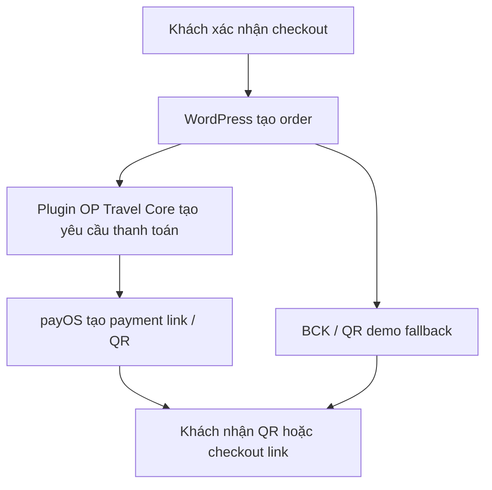
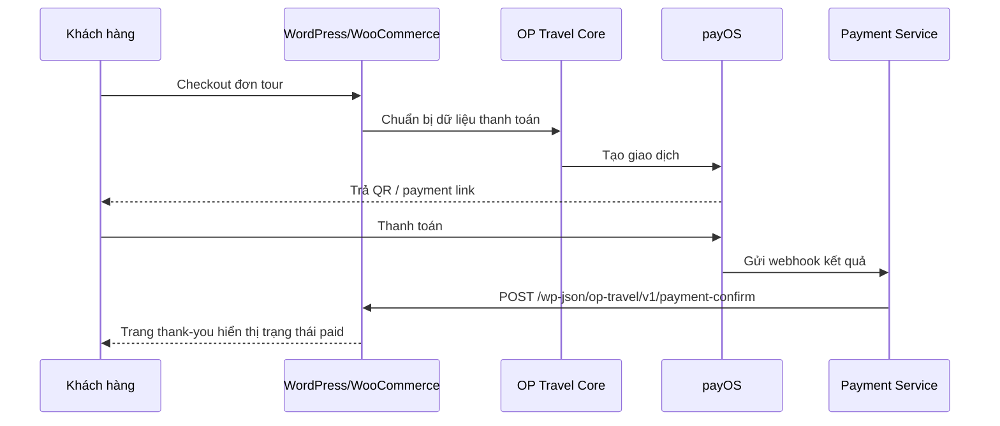

# Phase 6 - Thanh toán trực tuyến, QR và thông báo thành công

## Mục tiêu phase
Thiết kế và trình bày chiến lược thanh toán trực tuyến cho HV-Travel, trong đó `payOS` là phương án chính, `BCK` là phương án dự phòng/minh họa, và trải nghiệm người dùng phải kết thúc bằng thông báo thanh toán thành công rõ ràng.

## Đầu vào
- Luồng WooCommerce checkout hiện có
- `DemoPaymentQrHooks.php`
- `DemoPaymentQrData.php`
- Plugin `BCK`

## Đầu ra
- Kiến trúc thanh toán nhất quán
- Câu chuyện demo thuyết phục: chọn tour, thanh toán, quét QR, cập nhật đơn, hiển thị thành công
- Danh sách việc cần làm để chuyển từ QR demo sang payment online thật

## Ý nghĩa với BCCĐ
Đây là phase dễ tạo ấn tượng nhất khi bảo vệ. Nếu demo được lúc khách chọn tour, thanh toán QR và thấy ngay trạng thái thành công trên thank-you page, hội đồng sẽ nhìn thấy tính ứng dụng thực tế rất rõ của hệ thống.

## Nguyên tắc thanh toán bắt buộc
- `payOS` là hướng thanh toán online chính; `BCK` và QR demo chỉ là fallback/minh họa.
- Không coi `returnUrl` là xác nhận thanh toán cuối cùng; webhook mới là nguồn xác nhận chuẩn.
- Status business phải giữ đúng vocabulary: `pending`, `paid`, `failed`, `expired`, `cancelled`.
- Callback từ service về WordPress phải đi qua `POST /wp-json/op-travel/v1/payment-confirm` và dùng `PAYMENT_SYNC_SECRET`.
- Webhook phải có xác thực chữ ký/checksum, kiểm tra amount, transaction id và cơ chế idempotency.

## Lý do chọn cổng thanh toán
### Vì sao chọn `payOS` làm hướng chính
- Có mô hình thanh toán online phù hợp môi trường Việt Nam
- Hỗ trợ QR/checkout dễ kể chuyện trong demo
- Có khái niệm `returnUrl`, `cancelUrl`, `webhook`
- Phù hợp với kiến trúc service ngoài WordPress

### Vì sao giữ `BCK` làm dự phòng
- Repo hiện đã có plugin `BCK`
- Có thể dùng để minh họa cơ chế QR/chuyển khoản tự động
- Dễ trình bày như một lớp fallback nếu chưa dùng cổng online thật

## Luồng tạo QR

## Luồng khách thanh toán

## `returnUrl`
`returnUrl` là URL khách được chuyển về sau khi hoàn tất thanh toán. Trong HV-Travel, nên trỏ về trang thank-you hoặc route gắn với order của WooCommerce để:

- Hiển thị mã đơn
- Hiển thị trạng thái thanh toán
- Hiển thị hành động tiếp theo

Ví dụ hướng thiết kế:
- `https://hv-travel.example.com/checkout/order-received/{order_id}`

## `cancelUrl`
`cancelUrl` là URL quay về khi khách hủy thanh toán hoặc đóng giao dịch. Nên đưa về:

- giỏ hàng nếu muốn khách chỉnh lại đơn
- hoặc checkout nếu muốn khách thử lại cổng thanh toán khác

Khuyến nghị:
- Quay về `/thanh-toan/` kèm thông báo đơn đang ở trạng thái `pending`

## `webhook`
`webhook` là mắt xích bắt buộc nếu muốn hệ thống biết giao dịch đã thành công mà không phụ thuộc việc khách có quay lại trình duyệt hay không.

### Webhook đề xuất
- `POST /api/payments/payos/webhook`

### Nhiệm vụ của webhook service
- Xác thực chữ ký từ payOS
- Chống replay hoặc duplicate callback
- Ghi `payment_events` vào MongoDB
- Cập nhật bản ghi payment
- Gọi `POST /wp-json/op-travel/v1/payment-confirm` về WordPress

## Ma trận trách nhiệm thanh toán
| Thành phần | Vai trò | Không nên làm |
| --- | --- | --- |
| `Theme thank-you page` | Hiển thị trạng thái cuối, QR/panel và CTA | Tự xác nhận đơn đã `paid` chỉ theo browser return |
| `OP Travel Core` | Chuẩn bị dữ liệu payment, nhận callback nội bộ, cập nhật order state | Gọi trực tiếp MongoDB hoặc xác thực webhook provider tại template |
| `payOS` | Tạo payment link/QR, gửi webhook và điều hướng browser | Quyết định UI cuối của WordPress |
| `Booking/Payment Service` | Nhận webhook, xác thực chữ ký, lưu event, đồng bộ về WordPress | Render storefront hoặc thay theme |
| `BCK` / QR demo | Fallback cho sandbox hoặc buổi demo | Thay thế mặc định cho `payOS` trong toàn bộ kiến trúc |

## Hợp đồng kỹ thuật phải khóa
- `POST /api/payments/payos/webhook`
- `POST /wp-json/op-travel/v1/payment-confirm`
- `PAYMENT_SYNC_SECRET`
- `PAYOS_CLIENT_ID`
- `PAYOS_API_KEY`
- `PAYOS_CHECKSUM_KEY`

## Cập nhật trạng thái đơn
Trạng thái phải được thống nhất ở toàn bộ tài liệu:

- `pending`
- `paid`
- `failed`
- `expired`
- `cancelled`

Mapping thực tế:
- Order mới tạo: `pending`
- Webhook hợp lệ báo thành công: `paid`
- Giao dịch lỗi: `failed`
- Quá hạn thanh toán: `expired`
- Người dùng hủy hoặc admin hủy: `cancelled`

## Trang thanh toán thành công
Thank-you page hiện đã là một điểm mạnh của hệ thống. Khi nâng lên payOS thật, trang này phải tiếp tục là nơi hiển thị:

- Mã đơn
- Ngày đặt
- Tổng thanh toán
- Phương thức thanh toán
- Trạng thái `paid`
- Ghi chú xác nhận
- CTA xem đơn, xem thêm tour, liên hệ tư vấn

## Hiển thị QR theo order
Hiện tại `DemoPaymentQrHooks.php` đã:

- Chỉ hiển thị panel khi đúng gateway hỗ trợ
- Tạo QR riêng theo từng order
- Tạo nội dung chuyển khoản riêng theo order
- Hiển thị số tiền, tài khoản nhận, chủ tài khoản, hướng dẫn demo

Trong phiên bản hoàn thiện:
- payOS sẽ tạo QR/check out thật
- `DemoPaymentQrHooks` có thể chuyển vai trò thành fallback hoặc panel mô tả giao dịch

## Các trạng thái `pending/paid/failed/expired`
### `pending`
- Order đã tạo nhưng chưa có xác nhận thanh toán
- Hiển thị CTA tiếp tục thanh toán

### `paid`
- Đã có webhook hợp lệ
- Hiển thị thông báo thành công màu xanh
- Có thể gửi email xác nhận

### `failed`
- Giao dịch bị lỗi
- Cho phép thanh toán lại

### `expired`
- Quá thời gian hiệu lực của payment link hoặc QR
- Cho phép tạo lại giao dịch mới

### `cancelled`
- Người dùng đóng giao dịch hoặc admin chủ động hủy
- Có thể quay về checkout/cart với CTA thử lại phương thức khác

## Ma trận hiển thị thank-you theo trạng thái
| Trạng thái | Điều người dùng thấy | CTA nên có |
| --- | --- | --- |
| `pending` | Đơn đã tạo, chờ xác nhận thanh toán | Tiếp tục thanh toán / xem hướng dẫn |
| `paid` | Xác nhận thành công, mã đơn và thông tin giao dịch | Xem đơn / xem thêm tour |
| `failed` | Thanh toán lỗi hoặc không hợp lệ | Thử lại / quay về checkout |
| `expired` | Link hoặc QR đã hết hạn | Tạo giao dịch mới |
| `cancelled` | Giao dịch đã bị hủy | Quay về giỏ hàng / thanh toán lại |

## Xử lý bảo mật chữ ký
Phần webhook phải có các bước:

- Xác thực chữ ký / checksum
- So khớp mã đơn và số tiền
- Kiểm tra giao dịch chưa bị xử lý trước đó
- Dùng `PAYMENT_SYNC_SECRET` khi service gọi ngược về WordPress
- Ghi log mọi webhook để truy vết

## Xử lý thanh toán trùng
Thanh toán trùng là rủi ro có thật trong hệ thống callback:

- Nếu cùng một event được gửi lại nhiều lần, webhook phải idempotent
- Nếu đơn đã `paid`, callback tiếp theo không được tiếp tục cộng/trừ hay đổi trạng thái sai
- Nên dùng `payment_events` để giữ lịch sử nhận callback

## Phương án fallback
Nếu cổng online sandbox gặp sự cố trong buổi demo:

1. Chuyển sang `BCK`
2. Hoặc dùng panel QR demo hiện có
3. Hoặc chuẩn bị một đơn mẫu đã ở trạng thái `paid`

Điều quan trọng là không phá vỡ câu chuyện:
- website vẫn có QR theo order
- vẫn có trạng thái thanh toán
- vẫn có thank-you page hoàn chỉnh

## Checklist payment flow
| Hạng mục | Mô tả | Trạng thái |
| --- | --- | --- |
| Gateway chính | `payOS` là hướng chính | Cần bổ sung |
| Fallback | `BCK` hoặc QR demo dùng được khi sandbox lỗi | Đã có một phần |
| `returnUrl` | Trỏ đúng về thank-you/order received | Cần bổ sung |
| `cancelUrl` | Quay lại checkout hoặc cart | Cần bổ sung |
| Webhook verify | Chữ ký, amount, transaction id, replay | Cần bổ sung |
| Idempotency | Callback trùng không phá trạng thái | Cần bổ sung |
| WordPress confirm | Gọi `POST /wp-json/op-travel/v1/payment-confirm` | Cần bổ sung |
| Thank-you states | Hiển thị đủ `pending/paid/failed/expired/cancelled` | Cần rà lại |
| Success email | Gửi mail sau khi xác nhận hợp lệ | Cần bổ sung |

## Minh chứng trong source code
- `wp-content/plugins/op-travel-core/includes/DemoPaymentQrHooks.php`
- `wp-content/plugins/op-travel-core/includes/Domain/DemoPaymentQrData.php`
- `wp-content/themes/op-travel-shop/woocommerce/checkout/thankyou.php`
- `wp-content/themes/op-travel-shop/inc/woocommerce.php`
- `wp-content/plugins/bck-tu-dong-xac-nhan-thanh-toan-chuyen-khoan-ngan-hang/readme.txt`

## Những gì đã có
- Thank-you page được tùy biến chuyên biệt
- QR demo theo order đã tồn tại
- Gateway ưu tiên đã được sắp xếp trong theme
- `BCK` đã có mặt trong repo

## Những gì cần bổ sung để hoàn thiện đồ án
- Tích hợp `payOS` thật
- Tạo service nhận webhook
- Tạo endpoint `POST /wp-json/op-travel/v1/payment-confirm`
- Cập nhật order status theo webhook
- Bổ sung email thanh toán thành công
- Thêm idempotency và lưu `payment_events` cho callback

## Cách trình bày khi bảo vệ
- Nói rõ có hai lớp: `payOS` chính, `BCK` dự phòng.
- Mở checkout và chỉ ra gateway được ưu tiên.
- Đặt một đơn tour mẫu.
- Cho thấy QR được sinh theo order.
- Giải thích webhook là chìa khóa để cập nhật trạng thái.
- Mở thank-you page và chỉ thông báo thành công.
- Nói thêm về xử lý `pending`, `failed`, `expired`.
- Chốt rằng hệ thống không chỉ “hiển thị QR” mà còn có luồng xác nhận trạng thái thanh toán.

## Kết luận phase
Phase 6 là cầu nối giữa giao diện đẹp và hệ thống vận hành thật. Khi phần thanh toán được tổ chức đúng, HV-Travel không còn là demo tĩnh mà trở thành một hệ thống có thể giao dịch thực sự. Điều này mở đường tự nhiên cho phase tiếp theo: đưa dữ liệu booking và payment sang MongoDB để phục vụ log, báo cáo và khả năng mở rộng nghiệp vụ.
