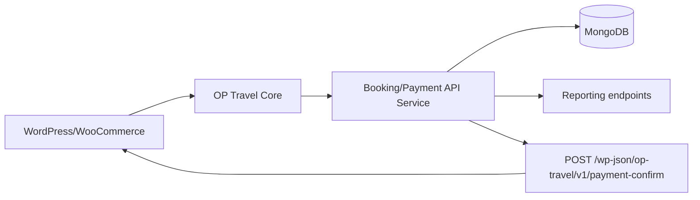
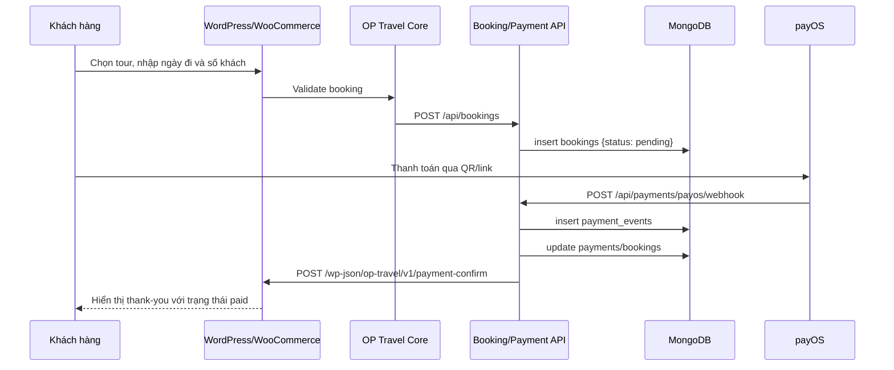

# Phase 7 - Tích hợp MongoDB cho nghiệp vụ

## Mục tiêu phase
Giải thích cách đưa `MongoDB` vào hệ thống HV-Travel một cách kỹ thuật đúng đắn: không thay thế database của WordPress core, mà đóng vai trò kho dữ liệu nghiệp vụ cho booking, payment, event log và report thông qua service trung gian.

## Đầu vào
- Kiến trúc WordPress/WooCommerce hiện tại
- Nhu cầu dùng MongoDB trong BCCĐ
- Luồng booking và thanh toán ở các phase trước

## Đầu ra
- Kiến trúc `WordPress -> service -> MongoDB` rõ ràng
- Danh sách collection và schema đề xuất
- Lập luận phản biện chặt chẽ cho câu hỏi “vì sao không dùng MongoDB trực tiếp cho WordPress core”

## Ý nghĩa với BCCĐ
Đây là phase nâng mức độ kỹ thuật của đồ án. Nếu trình bày tốt phase này, sinh viên sẽ thể hiện được khả năng phân biệt giữa hệ quản trị dữ liệu của nền tảng và cơ sở dữ liệu phục vụ nghiệp vụ mở rộng.

## Nguyên tắc MongoDB bắt buộc
- WordPress/WooCommerce tiếp tục chạy trên `MySQL`.
- `MongoDB` chỉ được chạm qua service business riêng theo flow `WordPress -> service -> MongoDB`.
- `bookings` là snapshot nghiệp vụ, không thay thế order WooCommerce.
- `payments` và `payment_events` phải tách khỏi order status để phục vụ audit, idempotency và debug.
- `reports` là read-model phục vụ dashboard, không query trực tiếp vào core tables của WordPress khi cần thống kê business.

## Vì sao không dùng MongoDB trực tiếp cho WordPress core
WordPress và WooCommerce được thiết kế xoay quanh mô hình dữ liệu quan hệ và các bảng chuẩn như:

- `wp_posts`
- `wp_postmeta`
- `wp_terms`
- `wp_term_taxonomy`
- `wp_term_relationships`
- `wp_users`
- `wp_usermeta`
- các bảng order, session, analytics của WooCommerce

Vì vậy:
- Core WordPress không vận hành trực tiếp trên MongoDB theo cách tiêu chuẩn.
- Nếu cố thay MySQL bằng MongoDB ở mức core, hệ thống sẽ mất tính ổn định, khó bảo trì và rất khó giải thích khi bảo vệ.
- Giải pháp đúng kỹ thuật là: giữ `MySQL` cho WordPress/WooCommerce, đưa `MongoDB` vào phần nghiệp vụ mở rộng.

## Kiến trúc WordPress -> service -> MongoDB

## Sequence luồng booking - thanh toán

## Các collection
- `bookings`
- `payments`
- `payment_events`
- `contacts`
- `reports`

## Ma trận trigger và collection
| Trigger nghiệp vụ | Endpoint / nguồn | Collection chính | Mục đích |
| --- | --- | --- | --- |
| Tạo booking từ WordPress | `POST /api/bookings` | `bookings` | Giữ snapshot booking tại thời điểm chốt đơn |
| Tạo payment link / QR | service nội bộ | `payments` | Theo dõi giao dịch ở mức business |
| Nhận webhook `payOS` | `POST /api/payments/payos/webhook` | `payment_events`, `payments`, `bookings` | Audit, idempotency và cập nhật trạng thái |
| Gửi contact form | submit từ `CmsSetup` hoặc service bridge | `contacts` | Lưu lead phục vụ vận hành/marketing |
| Tổng hợp doanh thu | job hoặc service report | `reports` | Tạo read-model cho dashboard nhanh |

## Schema đề xuất
### `bookings`
Mục tiêu:
- lưu snapshot booking tại thời điểm khách chốt đơn
- hỗ trợ truy vết nghiệp vụ ngoài WordPress

Các trường đề xuất:
- `booking_code`
- `wordpress_order_id`
- `wordpress_order_key`
- `product_id`
- `tour_code`
- `tour_name`
- `departure_date`
- `adult_count`
- `child_count`
- `customer_note`
- `customer_name`
- `customer_email`
- `customer_phone`
- `amount`
- `currency`
- `payment_status`
- `created_at`
- `updated_at`

### `payments`
Mục tiêu:
- lưu giao dịch thanh toán ở mức business
- tách riêng khỏi order status của WooCommerce

Các trường đề xuất:
- `payment_code`
- `booking_code`
- `wordpress_order_id`
- `gateway`
- `amount`
- `currency`
- `status`
- `checkout_url`
- `qr_url`
- `provider_transaction_id`
- `paid_at`
- `created_at`
- `updated_at`

### `payment_events`
Mục tiêu:
- lưu mọi lần callback hoặc webhook đến
- dùng cho idempotency, audit và debug

Các trường đề xuất:
- `event_id`
- `payment_code`
- `provider`
- `event_type`
- `signature_valid`
- `payload`
- `received_at`
- `processed_at`
- `result`

### `contacts`
Mục tiêu:
- lưu lead gửi từ form liên hệ để hỗ trợ vận hành và marketing

Các trường đề xuất:
- `full_name`
- `email`
- `phone`
- `message`
- `source_page`
- `created_at`

### `reports`
Mục tiêu:
- lưu dữ liệu tổng hợp sẵn để dashboard đọc nhanh

Các trường đề xuất:
- `report_date`
- `total_bookings`
- `paid_bookings`
- `revenue_total`
- `top_destination`
- `generated_at`

## `bookings`
Đây là collection quan trọng nhất vì nó nối giữa WordPress order và dữ liệu nghiệp vụ riêng. Khi khách nhấn checkout, plugin nên gửi snapshot booking sang service:

- Order ID của WooCommerce
- Product/tour đã chọn
- Ngày khởi hành
- Số lượng khách
- Ghi chú
- Thông tin khách
- Trạng thái mặc định `pending`

## `payments`
Collection này giúp tách lớp payment khỏi order của WooCommerce:

- WooCommerce biết đây là đơn hàng
- `payments` biết đây là giao dịch
- Mỗi payment có thể có link, QR, provider transaction id và lịch sử riêng

## Trách nhiệm của service business
- Nhận booking snapshot từ plugin WordPress.
- Tạo và cập nhật bản ghi `payments`.
- Nhận webhook từ `payOS`, xác thực chữ ký và chặn callback trùng.
- Ghi `payment_events` trước khi đổi trạng thái cuối.
- Gọi ngược về WordPress qua `POST /wp-json/op-travel/v1/payment-confirm` khi cần đồng bộ order state.
- Cung cấp `GET /api/reports/revenue` hoặc các read-model tương tự cho phần báo cáo.

## `payment_events`
Collection này cực kỳ quan trọng cho:

- kiểm tra thanh toán trùng
- kiểm tra webhook giả mạo
- truy vết giao dịch khi có lỗi
- chứng minh hệ thống có tư duy production

## `contacts`
Vì `CmsSetup.php` đã có contact form, việc lưu contact sang MongoDB là hợp lý:

- phục vụ báo cáo lead
- không làm phình dữ liệu WordPress chính
- thuận tiện cho xử lý marketing hoặc chăm sóc khách hàng sau này

## `reports`
Collection `reports` có thể được tạo định kỳ hoặc sau mỗi giao dịch để phục vụ dashboard:

- doanh thu theo ngày
- doanh thu theo điểm đến
- số booking theo trạng thái
- tỷ lệ thanh toán thành công

## Cơ chế đồng bộ dữ liệu
### Khi tạo booking
- Plugin gọi `POST /api/bookings`
- Service ghi `bookings` với trạng thái `pending`

### Khi nhận webhook thanh toán
- Service gọi `POST /api/payments/payos/webhook`
- Ghi `payment_events`
- Update `payments.status`
- Update `bookings.payment_status`
- Gọi lại WordPress để đổi order state

### Khi gửi contact form
- Có thể mở rộng plugin để đồng bộ form liên hệ sang `contacts`

## Checklist service và MongoDB
| Hạng mục | Mô tả | Trạng thái |
| --- | --- | --- |
| Boundary | Giữ `WordPress -> service -> MongoDB` | Cần áp dụng |
| `bookings` | Có snapshot đủ dữ liệu khách, tour, ngày đi, amount | Cần bổ sung |
| `payments` | Có payment record riêng khỏi order status | Cần bổ sung |
| `payment_events` | Có audit trail và idempotency | Cần bổ sung |
| `contacts` | Có thể nhận dữ liệu lead nếu cần | Cần bổ sung |
| `reports` | Có read-model doanh thu | Cần bổ sung |
| Callback WordPress | Gọi `POST /wp-json/op-travel/v1/payment-confirm` | Cần bổ sung |
| Backup MongoDB | Có `mongodump` hoặc chiến lược tương đương | Cần bổ sung |
| Report endpoint | Có `GET /api/reports/revenue` | Cần bổ sung |

## Lợi ích của document model
- Dễ lưu payload thanh toán và webhook gốc
- Dễ mở rộng trường mà không phải migration nặng
- Hợp với dữ liệu event log, report snapshot, lead và lịch sử booking
- Thuận tiện cho các dashboard nhanh hoặc các API ngoài WordPress

## Nhật ký giao dịch
MongoDB nên được dùng để lưu nhật ký vì:

- không nên nhồi toàn bộ payload webhook vào bảng WordPress
- dễ lọc và truy vấn theo thời gian, provider, trạng thái
- hỗ trợ xử lý sự cố sau buổi demo hoặc khi chạy production

## Báo cáo quản trị
MongoDB phù hợp để phục vụ các báo cáo như:

- doanh thu theo ngày khởi hành
- số lượng booking theo điểm đến
- tỷ lệ đơn đã thanh toán
- số contact lead theo ngày
- gateway nào đang được dùng nhiều hơn

## Minh chứng trong source code
- `wp-content/plugins/op-travel-core/includes/BookingHooks.php`
- `wp-content/plugins/op-travel-core/includes/ProductMeta.php`
- `wp-content/plugins/op-travel-core/includes/CmsSetup.php`
- `wp-content/plugins/op-travel-core/includes/DemoPaymentQrHooks.php`
- `wp-config.php`

## Những gì đã có
- Luồng booking đủ dữ liệu để đồng bộ ra ngoài
- Order WooCommerce đủ làm nguồn sự thật cho giao dịch
- Contact form đã tồn tại
- QR/payment demo đã có nền cho luồng event

## Những gì cần bổ sung để hoàn thiện đồ án
- Viết `booking-payment-service`
- Tạo các endpoint `POST /api/bookings`, `POST /api/payments/payos/webhook`, `GET /api/reports/revenue`
- Thêm lớp gọi API từ plugin WordPress
- Tạo cron hoặc job tạo report
- Tạo admin screen hoặc REST read-model nếu muốn hiển thị báo cáo trong WordPress
- Bổ sung chiến lược backup/restore cho MongoDB và log retention cho `payment_events`

## Cách trình bày khi bảo vệ
- Nói thẳng: WordPress vẫn chạy bằng MySQL, đó là kiến trúc đúng.
- Sau đó giải thích MongoDB dùng cho nghiệp vụ mở rộng.
- Vẽ hoặc mở sơ đồ `WordPress -> service -> MongoDB`.
- Nêu 5 collection chính.
- Giải thích vì sao `payment_events` rất quan trọng khi có webhook.
- Nói về lợi ích truy vấn báo cáo nhanh và lưu log linh hoạt.
- Chốt rằng MongoDB xuất hiện có mục đích rõ ràng, không phải thêm vào cho “đủ công nghệ”.

## Kết luận phase
Phase 7 giúp HV-Travel bước từ một site bán tour sang một kiến trúc có khả năng mở rộng nghiệp vụ. Với MongoDB làm lớp dữ liệu business và service trung gian làm cầu nối, đồ án vừa giữ được sự ổn định của WordPress/WooCommerce, vừa thỏa mãn yêu cầu sử dụng cơ sở dữ liệu hiện đại. Phase tiếp theo sẽ đưa kiến trúc này lên môi trường trực tuyến bằng Docker và Render.
