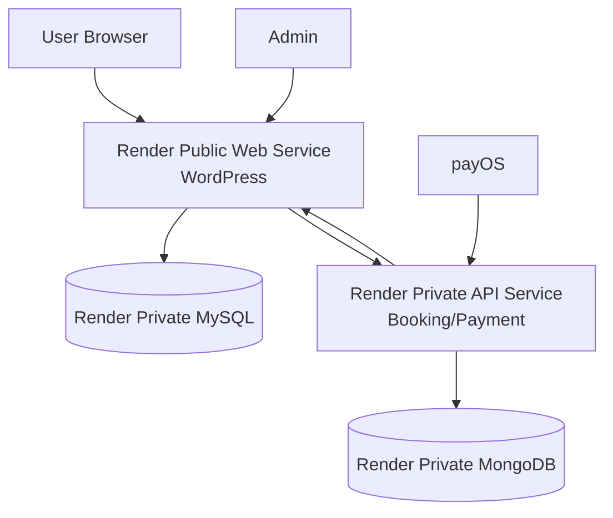

# Phase 8 - Docker và deploy Render

## Mục tiêu phase
Xây dựng kế hoạch triển khai online cho HV-Travel bằng Docker trên Render, với kiến trúc tách nhiều service thay vì dồn tất cả vào một container production.

## Đầu vào
- Source code WordPress hiện tại
- Kiến trúc cần có MySQL, MongoDB, payment service
- Yêu cầu website phải chạy trực tuyến để demo

## Đầu ra
- Kế hoạch deploy production rõ ràng
- Danh sách service cần tạo trên Render
- Danh sách biến môi trường, storage, domain, backup, restore

## Ý nghĩa với BCCĐ
Đây là phase chứng minh đồ án có thể “lên mạng thật”. Hội đồng thường đánh giá cao các đồ án không dừng ở local mà có môi trường chạy online, tên miền, HTTPS, quy trình deploy và cách đảm bảo dữ liệu không bị mất.

## Nguyên tắc deploy bắt buộc
- Không mô tả production như một container all-in-one.
- Chỉ `WordPress web service` là public.
- `MySQL`, `MongoDB` và `booking/payment API service` phải đi qua private networking.
- Secret và env phải tách theo service, không copy toàn bộ biến vào mọi container.
- Sau mỗi deploy phải có smoke test và log review.
- Rollback phải dựa trên branch/tag ổn định từ phase 3, không sửa tay trên host.

## Kiến trúc service trên Render

## Nguyên tắc triển khai
- Không mô tả production như một container “all-in-one”.
- Tách rõ web, database và service nghiệp vụ.
- Chỉ `WordPress web service` là public.
- `MySQL`, `MongoDB`, `API service` dùng private networking.
- Dùng persistent disk cho dữ liệu cần giữ lâu dài.

## Ma trận service và quyền truy cập
| Service | Public/Private | Trách nhiệm | Dữ liệu cần giữ |
| --- | --- | --- | --- |
| `WordPress web service` | Public | Render storefront, admin, WooCommerce, theme/plugin | uploads, app config |
| `MySQL` | Private | WordPress/WooCommerce core DB | database volume |
| `MongoDB` | Private | `bookings`, `payments`, `payment_events`, `contacts`, `reports` | database volume |
| `booking/payment API service` | Private, chỉ mở các endpoint webhook cần thiết | booking sync, payment webhook, report API, callback WordPress | service logs, retry state nếu có |

## WordPress web service
### Vai trò
- Chạy frontend và backend WordPress
- Phục vụ theme `op-travel-shop`
- Chạy plugin `op-travel-core`, WooCommerce, WP Mail SMTP, BCK

### Cần cấu hình
- Dockerfile cho WordPress
- `WORDPRESS_DB_HOST`
- `WORDPRESS_DB_NAME`
- `WORDPRESS_DB_USER`
- `WORDPRESS_DB_PASSWORD`
- URL website production
- Secret dùng khi nhận callback nội bộ từ payment service

### Dữ liệu cần giữ
- `wp-content/uploads`
- có thể mount ra persistent disk hoặc object storage tùy chiến lược sau này

## MySQL private service
### Vai trò
- Chứa toàn bộ dữ liệu WordPress/WooCommerce

### Lưu ý
- Không public ra internet
- Chỉ cho WordPress truy cập qua private network
- Cần persistent disk
- Cần backup định kỳ

## MongoDB private service
### Vai trò
- Chứa `bookings`, `payments`, `payment_events`, `contacts`, `reports`

### Lưu ý
- Không public ra internet
- Chỉ `booking-payment-service` truy cập trực tiếp
- Có persistent disk riêng
- Có chính sách `mongodump`

## Payment/booking API service
### Vai trò
- Nhận `POST /api/bookings`
- Nhận `POST /api/payments/payos/webhook`
- Cung cấp `GET /api/reports/revenue`
- Gọi `POST /wp-json/op-travel/v1/payment-confirm` về WordPress

### Công nghệ có thể dùng
- Node.js + Express
- hoặc NestJS nếu muốn kiến trúc dày hơn

### Lưu ý
- Là private service
- Nếu hạ tầng yêu cầu nhận webhook từ bên ngoài, chỉ mở đúng ingress/endpoint cần thiết cho webhook thay vì public toàn bộ service
- Cần log đầy đủ request, event, retry

## Persistent disk
Phải có persistent disk cho:

- dữ liệu MySQL
- dữ liệu MongoDB
- uploads của WordPress nếu lưu local

Nếu không có persistent disk:
- deploy lại hoặc restart có thể làm mất dữ liệu
- không phù hợp cho đồ án chạy online thật

## Domain
Khuyến nghị:
- dùng domain riêng dễ nhớ, ví dụ `hvtravel-demo.example.com`
- map domain vào WordPress web service
- cấu hình `Site URL` và `Home URL` đúng môi trường production

## HTTPS
- Bật HTTPS trên Render
- Bắt buộc dùng HTTPS cho:
  - website chính
  - callback/return URL từ cổng thanh toán
  - webhook endpoint

## Environment variables
### WordPress web service
- `WORDPRESS_DB_HOST`
- `WORDPRESS_DB_NAME`
- `WORDPRESS_DB_USER`
- `WORDPRESS_DB_PASSWORD`
- `WP_DEBUG=false`
- `PAYMENT_SYNC_SECRET`

### Booking/payment API service
- `MONGO_URI`
- `PAYOS_CLIENT_ID`
- `PAYOS_API_KEY`
- `PAYOS_CHECKSUM_KEY`
- `PAYMENT_SYNC_SECRET`
- `WORDPRESS_CONFIRM_ENDPOINT`

### SMTP
- `SMTP_HOST`
- `SMTP_PORT`
- `SMTP_USER`
- `SMTP_PASS`

## Ma trận env theo service
| Biến | WordPress | API service | Ghi chú |
| --- | --- | --- | --- |
| `WORDPRESS_DB_HOST` | Có | Không | Chỉ web service cần |
| `WORDPRESS_DB_NAME` | Có | Không | Chỉ web service cần |
| `WORDPRESS_DB_USER` | Có | Không | Chỉ web service cần |
| `WORDPRESS_DB_PASSWORD` | Có | Không | Chỉ web service cần |
| `WP_DEBUG` | Có | Không | Production nên `false` |
| `MONGO_URI` | Không | Có | Chỉ service business chạm MongoDB |
| `PAYOS_CLIENT_ID` | Không | Có | Không nhét vào container WordPress nếu không cần |
| `PAYOS_API_KEY` | Không | Có | Secret payment |
| `PAYOS_CHECKSUM_KEY` | Không | Có | Dùng để verify webhook |
| `PAYMENT_SYNC_SECRET` | Có | Có | Dùng cho callback nội bộ |
| `WORDPRESS_CONFIRM_ENDPOINT` | Không | Có | Service gọi ngược về WordPress |
| `SMTP_HOST/PORT/USER/PASS` | Có | Không hoặc tùy service | Chủ yếu phục vụ mail từ WordPress |

## Auto deploy
Quy trình đề xuất:

1. Push code lên GitHub
2. Kết nối repo với Render
3. Chọn nhánh deploy, thường là `main`
4. Sau mỗi merge vào `main`, Render build và redeploy tự động

Điểm mạnh khi trình bày:
- có quy trình triển khai rõ ràng
- giảm thao tác thủ công
- gắn chặt version control với môi trường online

## Gate trước khi deploy production
1. Nhánh release đã merge vào `main`.
2. Theme/plugin/payment flow đã qua smoke test local hoặc staging.
3. Env production đã đủ và không lẫn secret sai service.
4. Persistent disk đã gắn cho MySQL, MongoDB và uploads nếu dùng local storage.
5. Có backup gần nhất trước khi redeploy.

## Backup
### WordPress/MySQL
- `mysqldump` định kỳ
- backup plugin/media bằng `UpdraftPlus`

### MongoDB
- `mongodump` định kỳ
- lưu bản backup ra nơi tách biệt với máy chạy chính

### Tài liệu và source
- backup qua Git remote

## Restore
Quy trình khôi phục nên được chuẩn bị trên lý thuyết:

1. Khôi phục MySQL từ dump
2. Khôi phục MongoDB từ dump
3. Khôi phục uploads và plugin/theme nếu cần
4. Kiểm tra URL và env
5. Chạy test smoke sau restore

## Giám sát log
Các log cần xem:
- log WordPress/PHP
- `wp-content/debug.log`
- log container WordPress
- log API service
- log webhook payOS
- log MongoDB

Điểm quan trọng:
- không chỉ biết deploy, mà còn biết theo dõi hệ thống sau deploy

## Smoke test sau deploy
| Hạng mục | Điều cần xác nhận |
| --- | --- |
| Homepage | Trang chủ lên đúng theme, không lỗi asset |
| Archive | `/tours/` hoạt động và filter taxonomy vẫn chạy |
| Single tour | Metadata và booking fields hiển thị |
| Cart/Checkout | Tạo order được, không lỗi session hoặc mapping page |
| Thank-you | Hiển thị trạng thái và panel QR/payout message đúng |
| Payment callback | Service gọi được `POST /wp-json/op-travel/v1/payment-confirm` |
| MongoDB | Có ghi `bookings`/`payment_events` nếu flow đã tích hợp |
| Email | SMTP gửi được nếu demo mail |

## Quy trình deploy bản mới
1. Hoàn thiện tính năng ở `develop`
2. Tạo `release/*`
3. Kiểm thử local
4. Merge vào `main`
5. Render auto-deploy
6. Chạy smoke test production:
   - mở trang chủ
   - mở archive tour
   - mở single tour
   - tạo đơn test
   - kiểm tra QR/payment
   - kiểm tra thank-you
7. Nếu lỗi nhẹ, tạo `hotfix/*`
8. Nếu lỗi nặng, rollback về tag ổn định gần nhất

## Minh chứng trong source code
- `wp-config.php`
- `wp-content/themes/op-travel-shop/`
- `wp-content/plugins/op-travel-core/`
- `wp-content/debug.log`
- `Phases/`

## Những gì đã có
- Source WordPress đầy đủ để đóng gói container
- Theme và plugin tách riêng, thuận lợi cho deploy
- Kiến trúc business đã đủ để tách thêm service

## Những gì cần bổ sung để hoàn thiện đồ án
- `Dockerfile` cho WordPress
- `docker-compose.yml` cho local
- source cho `booking-payment-service`
- biến môi trường cho từng service
- tài liệu thao tác deploy từng bước trên Render
- script hoặc checklist rollback theo tag ổn định

## Cách trình bày khi bảo vệ
- Nói rõ website không chỉ chạy local mà có kế hoạch lên cloud.
- Vẽ sơ đồ 4 service: WordPress, MySQL, MongoDB, API service.
- Nhấn mạnh chỉ WordPress là public.
- Giải thích vì sao phải có persistent disk.
- Giải thích auto-deploy từ Git.
- Nói về backup và restore để tăng độ tin cậy của hệ thống.
- Chốt rằng đây là kiến trúc production nhỏ gọn nhưng đúng tư duy triển khai.

## Kết luận phase
Phase 8 hoàn thiện câu chuyện vận hành của HV-Travel: hệ thống có thể triển khai thực tế, có tách lớp dịch vụ, có bảo toàn dữ liệu và có quy trình phát hành rõ ràng. Trên nền đó, phase tiếp theo sẽ tập trung vào kiểm thử, nghiệm thu và tổ chức kịch bản demo sao cho buổi bảo vệ diễn ra trơn tru, ít rủi ro nhất.
