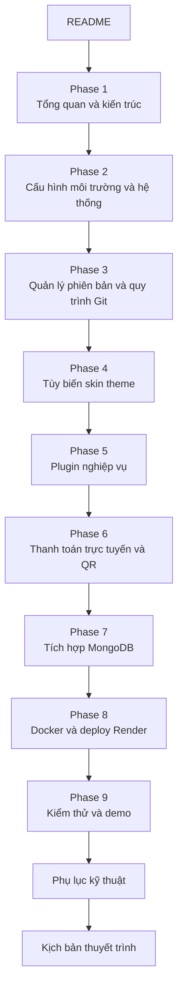

# Bộ Tài Liệu BCCĐ - HV-Travel

## Giới thiệu đề tài
HV-Travel là website bán vé tour du lịch xây dựng trên nền `WordPress + WooCommerce`, có `theme` riêng `op-travel-shop` và `plugin` nghiệp vụ riêng `op-travel-core`. Bộ tài liệu này được biên soạn để phục vụ báo cáo, demo và bảo vệ BCCĐ theo hướng vừa có giá trị thực tiễn, vừa chứng minh được năng lực cấu hình hệ thống, quản lý phiên bản, tùy biến giao diện và lập trình plugin.

Trục kỹ thuật chính của đồ án được chốt như sau:

- `WordPress + WooCommerce` là website chính để quản trị nội dung, danh mục tour, giỏ hàng, checkout và đơn hàng.
- `MySQL` là cơ sở dữ liệu vận hành bắt buộc của WordPress/WooCommerce.
- `MongoDB` là cơ sở dữ liệu nghiệp vụ cho booking, log thanh toán, lịch sử webhook, contact lead và báo cáo.
- `Docker` là môi trường đóng gói dịch vụ.
- `Render` là nền tảng triển khai trực tuyến.

## Sơ đồ đọc tài liệu

## Kiến trúc tổng quát
Website HV-Travel lấy WooCommerce làm lõi thương mại điện tử để bán tour như sản phẩm dịch vụ, trong khi phần nghiệp vụ du lịch được tùy biến qua plugin `OP Travel Core` và giao diện đặt tour được tổ chức lại bằng theme `OP Travel Shop`. Luồng thanh toán được định hướng theo `payOS` cho bài toán thanh toán online và QR, đồng thời vẫn giữ `BCK` làm phương án minh họa dự phòng. Dữ liệu nghiệp vụ được đồng bộ sang một service riêng kết nối `MongoDB`, từ đó phục vụ báo cáo, nhật ký giao dịch và khả năng mở rộng sau này.

## Danh sách phase
1. `01-phase-1-tong-quan-de-tai-va-kien-truc.md`
2. `02-phase-2-cau-hinh-moi-truong-va-he-thong.md`
3. `03-phase-3-quan-ly-phien-ban-va-quy-trinh-git.md`
4. `04-phase-4-tuy-bien-skin-theme-op-travel-shop.md`
5. `05-phase-5-plugin-nghiep-vu-op-travel-core.md`
6. `06-phase-6-thanh-toan-truc-tuyen-qr-va-thong-bao-thanh-cong.md`
7. `07-phase-7-tich-hop-mongodb-cho-nghiep-vu.md`
8. `08-phase-8-docker-va-deploy-render.md`
9. `09-phase-9-kiem-thu-nghiem-thu-va-kich-ban-demo.md`
10. `10-phu-luc-api-env-va-checklist.md`
11. `11-kich-ban-thuyet-trinh-va-phan-cong-trinh-bay.md`

## Plugin sử dụng thống nhất trong toàn bộ tài liệu
- `WooCommerce`
- `OP Travel Core`
- `payOS`
- `BCK`
- `WP Mail SMTP`
- `UpdraftPlus`
- `Wordfence`

## Stack sử dụng thống nhất trong toàn bộ tài liệu
- `Frontend theme`: WordPress theme tùy biến `op-travel-shop`
- `Business plugin`: WordPress plugin tùy biến `op-travel-core`
- `Commerce engine`: WooCommerce
- `Core database`: MySQL cho WordPress/WooCommerce
- `Business database`: MongoDB cho booking/payment/log/report
- `Payment strategy`: payOS chính, BCK dự phòng
- `Container`: Docker
- `Hosting platform`: Render
- `Mail`: SMTP qua `WP Mail SMTP`
- `Backup`: UpdraftPlus
- `Security`: Wordfence

## Hợp đồng kỹ thuật chung phải giữ nhất quán
- Endpoint nội bộ WordPress: `POST /wp-json/op-travel/v1/payment-confirm`
- Endpoint service Mongo:
  - `POST /api/bookings`
  - `POST /api/payments/payos/webhook`
  - `GET /api/reports/revenue`
- Trạng thái nghiệp vụ:
  - `pending`
  - `paid`
  - `failed`
  - `expired`
  - `cancelled`
- Biến môi trường tối thiểu:
  - `WORDPRESS_DB_HOST`
  - `WORDPRESS_DB_NAME`
  - `WORDPRESS_DB_USER`
  - `WORDPRESS_DB_PASSWORD`
  - `MONGO_URI`
  - `PAYOS_CLIENT_ID`
  - `PAYOS_API_KEY`
  - `PAYOS_CHECKSUM_KEY`
  - `PAYMENT_SYNC_SECRET`
  - `SMTP_HOST`
  - `SMTP_PORT`
  - `SMTP_USER`
  - `SMTP_PASS`

## Cách sử dụng bộ tài liệu
- Nếu viết báo cáo tổng thể, đọc từ `Phase 1` đến `Phase 11`.
- Nếu cần chuẩn bị demo kỹ thuật, tập trung vào `Phase 2`, `Phase 4`, `Phase 5`, `Phase 6`, `Phase 8`, `Phase 9`.
- Nếu cần trả lời phản biện về kiến trúc và cơ sở dữ liệu, tập trung vào `Phase 1`, `Phase 7`, `Phase 8`.
- Nếu cần dựng slide bảo vệ, dùng `README`, `Phase 1`, `Phase 6`, `Phase 8`, `Phase 11`.

## Nguồn sự thật trong source code
- `wp-config.php`
- `wp-content/themes/op-travel-shop/`
- `wp-content/plugins/op-travel-core/`
- `wp-content/plugins/bck-tu-dong-xac-nhan-thanh-toan-chuyen-khoan-ngan-hang/`

## Kết luận
Bộ tài liệu này không chỉ mô tả một website WordPress bán tour, mà còn đóng vai trò bản đặc tả triển khai BCCĐ theo hướng thực chiến: có cấu hình, có plugin, có giao diện, có thanh toán, có cơ sở dữ liệu nghiệp vụ, có Docker và có kế hoạch chạy trực tuyến.
