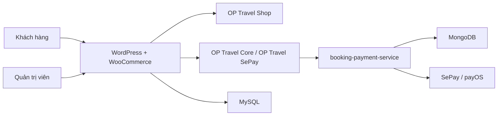
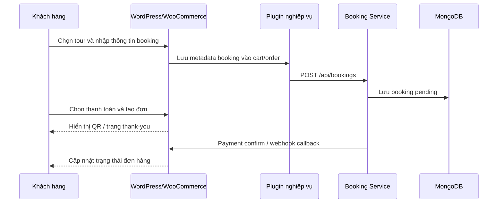

# HV-Travel - Website Bán Tour Du Lịch Trực Tuyến

## 1. Tên đề tài
**HV-Travel - Website bán tour du lịch trực tuyến tích hợp WooCommerce, booking service và thanh toán QR**

## 2. Giới thiệu website/hệ thống
HV-Travel là hệ thống website bán tour du lịch trực tuyến được xây dựng trên nền tảng `WordPress` và `WooCommerce`. Hệ thống hỗ trợ khách hàng xem danh sách tour, xem chi tiết tour, chọn ngày khởi hành, nhập thông tin booking, thêm vào giỏ hàng, thanh toán và theo dõi trạng thái đơn hàng.

Về kiến trúc, dự án tách thành 3 lớp chính:
- `WordPress + WooCommerce + MySQL`: quản trị nội dung, tour, giỏ hàng, checkout, đơn hàng và trang quản trị.
- `OP Travel Core + OP Travel Shop`: xử lý nghiệp vụ tour, booking flow, giao diện storefront và QR demo theo order.
- `booking-payment-service + MongoDB`: đồng bộ booking/payment, nhận webhook thanh toán, lưu event log và dữ liệu báo cáo nghiệp vụ.

## 3. Danh sách thành viên
> Repo không chứa thông tin họ tên/MSSV thực tế. Nhóm cần thay các dòng mẫu bên dưới bằng thông tin chính thức trước khi nộp.

| STT | Họ và tên | MSSV | Vai trò chính |
| --- | --- | --- | --- |
| 1 | `[Bổ sung thành viên 1]` | `[Bổ sung MSSV 1]` | Kiến trúc tổng thể, MongoDB, Docker, Render |
| 2 | `[Bổ sung thành viên 2]` | `[Bổ sung MSSV 2]` | Cấu hình WordPress/WooCommerce, giao diện theme, customer journey |
| 3 | `[Bổ sung thành viên 3]` | `[Bổ sung MSSV 3]` | Plugin nghiệp vụ, booking flow, thanh toán QR, kiểm thử demo |

## 4. MSSV từng thành viên
- Thành viên 1: `[Bổ sung MSSV 1]`
- Thành viên 2: `[Bổ sung MSSV 2]`
- Thành viên 3: `[Bổ sung MSSV 3]`

## 5. Phân công nhiệm vụ cụ thể
### Thành viên 1
- Phân tích đề tài, mô tả bài toán nghiệp vụ và kiến trúc tổng thể.
- Trình bày vai trò của `WordPress`, `WooCommerce`, `MySQL`, `MongoDB`, `Docker`, `Render`.
- Phụ trách luồng đồng bộ booking/payment qua `booking-payment-service`.

### Thành viên 2
- Cấu hình môi trường local với `Docker Compose`.
- Cài đặt `WordPress`, `WooCommerce`, theme `OP Travel Shop` và các plugin cần thiết.
- Tùy biến giao diện storefront, archive tour, single tour, cart, checkout và thank-you page.

### Thành viên 3
- Phát triển plugin `OP Travel Core`, `OP Travel SePay` và các thành phần booking nghiệp vụ.
- Xử lý booking fields, metadata tour, QR thanh toán, webhook/payment confirm.
- Chuẩn bị seed dữ liệu demo, checklist test và kịch bản demo/BCCĐ.

## 6. Công nghệ sử dụng
| Nhóm công nghệ | Công nghệ/Thành phần |
| --- | --- |
| CMS / Storefront | `WordPress` |
| E-commerce engine | `WooCommerce` |
| Theme custom | `wordpress/wp-content/themes/op-travel-shop` |
| Plugin nghiệp vụ | `wordpress/wp-content/plugins/op-travel-core` |
| Plugin thanh toán QR | `wordpress/wp-content/plugins/op-travel-sepay` |
| Plugin CMS nội dung | `wordpress/wp-content/plugins/op-travel-storefront-cms` |
| Backend service | `Node.js` (`services/booking-payment-service`) |
| Cơ sở dữ liệu core | `MySQL` |
| Cơ sở dữ liệu nghiệp vụ | `MongoDB` |
| Thanh toán / QR | `SePay`, `payOS`, fallback QR demo |
| Đóng gói môi trường | `Docker`, `Docker Compose` |
| Deploy | `Render` |
| Public webhook / hostname | `Cloudflared` (nếu cần) |

## 7. Hướng dẫn cài đặt
### Yêu cầu trước khi cài đặt
- `Git`
- `Docker Desktop` có `Docker Compose v2`
- `Node.js 20+` nếu muốn chạy smoke script từ máy host

### Các bước cài đặt
1. Clone source code:

```powershell
git clone <your-repo-url>
cd WordPress
```

2. Tạo các file môi trường từ file mẫu:

```powershell
Copy-Item env\wordpress.env.example env\wordpress.env
Copy-Item env\service.env.example env\service.env
Copy-Item env\tunnel.env.example env\tunnel.env
```

3. Kiểm tra và cập nhật các biến môi trường quan trọng:
- `env/wordpress.env`: `PUBLIC_SITE_URL`, `PAYMENT_SYNC_SECRET`, cấu hình SMTP nếu cần gửi mail.
- `env/service.env`: `MONGO_URI`, `PAYOS_*`, `SEPAY_*`, `WORDPRESS_CONFIRM_ENDPOINT`.
- `env/tunnel.env`: `TUNNEL_TOKEN` nếu cần public hostname hoặc webhook.

4. Chuẩn bị plugin/theme trong `wordpress/wp-content/` theo đúng cấu trúc repo hiện tại.

## 8. Hướng dẫn chạy project
### Khởi động stack local
```powershell
docker compose -f docker/compose.local.yml up -d --build
```

### Các URL local quan trọng
- Website: `http://localhost:8080`
- WordPress admin: `http://localhost:8080/wp-admin`
- phpMyAdmin: `http://localhost:8081`
- Service health: `http://localhost:8787/health`
- Revenue API: `http://localhost:8787/api/reports/revenue`

### Cấu hình sau khi mở project lần đầu
1. Mở `http://localhost:8080` và hoàn tất cài đặt WordPress ban đầu.
2. Đăng nhập `wp-admin`.
3. Cài và kích hoạt `WooCommerce`.
4. Kích hoạt theme `OP Travel Shop`.
5. Kích hoạt các plugin:
   - `OP Travel Core`
   - `OP Travel SePay`
   - `OP Travel Storefront CMS` (nếu muốn chỉnh nội dung storefront trong admin)
6. Vào `Tools > OP Travel Seeder` để seed dữ liệu demo.
7. Kiểm tra route `/tours/`, trang chi tiết tour, cart, checkout và thank-you page.

### Kiểm tra nhanh sau khi chạy
```powershell
docker compose -f docker/compose.local.yml config
docker compose -f docker/compose.local.yml ps
Invoke-WebRequest -UseBasicParsing http://localhost:8787/health
node scripts/acceptance-smoke.mjs
```

## 9. Tài khoản demo (nếu có)
Repo hiện tại **không commit sẵn tài khoản demo cố định** để tránh lộ thông tin đăng nhập.

Gợi ý chuẩn bị tài khoản cho buổi demo:
- `Admin WordPress`: tạo trong bước cài đặt WordPress lần đầu.
- `Tài khoản khách hàng`: có thể đăng ký tại trang `My Account`/đăng nhập sau khi cấu hình OTP/email.
- `Tài khoản demo cho hội đồng`: nhóm nên tạo sẵn 1 tài khoản admin và 1 tài khoản customer riêng trước khi bảo vệ.

## 10. Hình ảnh minh họa hệ thống
### Sơ đồ kiến trúc tổng thể


### Luồng đặt tour và thanh toán


## 11. Link video demo
- Chưa có link video demo trong repo.
- Nhóm bổ sung link `YouTube` hoặc `Google Drive` trước khi nộp bản cuối.

## 12. Link online đã deploy (nếu có)
- Public site theo cấu hình hiện tại trong `env/wordpress.env`: [https://wp-hv-travel.fshdx2105.id.vn](https://wp-hv-travel.fshdx2105.id.vn)
- Lưu ý: đây là URL đang được cấu hình trong repo; nhóm nên mở và kiểm tra lại tình trạng hoạt động trước khi nộp.
- Nếu cần deploy đầy đủ lên `Render`, tham khảo thêm:
  - `render.yaml`
  - `render.free-demo.yaml`
  - `docs/deploy/render-runbook.md`

## 13. Tài liệu tham khảo trong repo
- `Phases/01-phase-1-tong-quan-de-tai-va-kien-truc.md`
- `Phases/11-kich-ban-thuyet-trinh-va-phan-cong-trinh-bay.md`
- `docs/demo/local-e2e-acceptance.md`
- `services/booking-payment-service/README.md`
